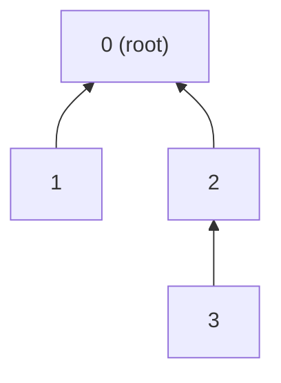

Disjoint Set Union (DSU) maintains a collection of separate groups. It is also
called **Union-Find**, after its two main operations:

- **Find:** which group does this node belong to?
- **Union:** merge the groups containing two nodes.

For example, suppose each node represents a computer. When a cable connects two
computers, DSU can merge their networks. It can then quickly answer whether any
two computers belong to the same network.

DSU is useful when connections are added over time. It does not store the actual
path between two nodes; it only tracks which connected component contains each
node.

## Representing a Component

DSU represents every component as a tree. Each node stores the index of its
parent in a `parent_` array. The root is the representative of the entire
component, and a root is its own parent.

With four separate nodes, every node starts as a one-node tree:

```text
node       0  1  2  3
parent_    0  1  2  3
size_      1  1  1  1
```

The `size_` array records the number of nodes in a component. Only a root's size
is meaningful. A non-root may contain an old value, but the algorithm never uses
it.

After joining all four nodes, one possible tree is:



Following parent links from `3` gives `3 -> 2 -> 0`, so node `0` is the
representative of node `3`'s component.

## Find: Locate the Root

`find(node)` follows parent links until it reaches a root:

```cpp
int find(int node) {
  if (parent_[node] == node) {
    return node;
  }

  return find(parent_[node]);
}
```

This is correct, but a tree could become tall. Repeated searches would then walk
through the same intermediate nodes.

### Path compression

Path compression makes every visited node point directly to the root:

```cpp
int find(int node) {
  if (parent_[node] == node) {
    return node;
  }

  parent_[node] = find(parent_[node]);
  return parent_[node];
}
```

For the tree above, calling `find(3)` first discovers root `0`, then changes
`parent_[3]` from `2` to `0`. The answer is unchanged, but the next search is
shorter:

```text
before find(3): 3 -> 2 -> 0
after find(3):  3 ------> 0
```

The assignment on the recursive line is the entire path-compression
optimization.

## Union: Merge Two Components

To merge the components containing `a` and `b`:

1. Find the root of each node.
2. If the roots are equal, the nodes are already connected.
3. Otherwise, make one root the parent of the other.

Either root could become the new representative, but attaching the smaller tree
below the larger tree keeps the result shallow. This is called **union by size**.

```cpp
bool unite(int a, int b) {
  int root_a = find(a);
  int root_b = find(b);

  if (root_a == root_b) {
    return false;
  }

  // Make root_a represent the larger component.
  if (size_[root_a] < size_[root_b]) {
    std::swap(root_a, root_b);
  }

  parent_[root_b] = root_a;
  size_[root_a] += size_[root_b];
  return true;
}
```

The return value tells the caller what happened:

- `true`: two different components were merged.
- `false`: both nodes were already in the same component.

## Connected: Compare the Roots

Two nodes are connected exactly when they have the same representative:

```cpp
bool connected(int a, int b) {
  return find(a) == find(b);
}
```

Notice that DSU does not compare the immediate parents. Two nodes can have
different parents and still eventually lead to the same root.

## Complete Implementation

```cpp
#include <utility>
#include <vector>

class DisjointSet {
 public:
  explicit DisjointSet(int node_count)
      : parent_(node_count), size_(node_count, 1) {
    // Initially, every node is the root of its own component.
    for (int node = 0; node < node_count; ++node) {
      parent_[node] = node;
    }
  }

  int find(int node) {
    if (parent_[node] == node) {
      return node;
    }

    // Compress the path while returning from the recursion.
    parent_[node] = find(parent_[node]);
    return parent_[node];
  }

  bool unite(int a, int b) {
    int root_a = find(a);
    int root_b = find(b);

    if (root_a == root_b) {
      return false;
    }

    // Attach the smaller component below the larger one.
    if (size_[root_a] < size_[root_b]) {
      std::swap(root_a, root_b);
    }

    parent_[root_b] = root_a;
    size_[root_a] += size_[root_b];
    return true;
  }

  bool connected(int a, int b) {
    return find(a) == find(b);
  }

  int componentSize(int node) {
    return size_[find(node)];
  }

 private:
  std::vector<int> parent_;
  std::vector<int> size_;
};
```

The class assumes that node IDs are in the range `0` to `node_count - 1`.

## Worked Example

Start with four independent nodes:

```text
parent_ = [0, 1, 2, 3]
size_   = [1, 1, 1, 1]
```

### `unite(0, 1)`

The roots are `0` and `1`. Their sizes are equal, so this implementation keeps
`0` as the root and attaches `1` below it:

```text
parent_ = [0, 0, 2, 3]
size_   = [2, 1, 1, 1]
```

### `unite(2, 3)`

The same process creates a second two-node component:

```text
parent_ = [0, 0, 2, 2]
size_   = [2, 1, 2, 1]
```

At this point, `connected(0, 1)` is `true`, while `connected(1, 2)` is `false`.

### `unite(1, 3)`

The method does not attach node `3` directly to node `1`. It first finds their
roots:

```text
find(1) = 0
find(3) = 2
```

The components have equal size, so root `2` is attached below root `0`:

```text
parent_ = [0, 0, 0, 2]
size_   = [4, 1, 2, 1]
```

`size_[2]` still contains `2`, but node `2` is no longer a root, so that value is
ignored. `componentSize(3)` finds root `0` and correctly returns `size_[0]`, which
is `4`.

Calling `connected(0, 3)` also runs `find(3)`. Path compression then changes the
last parent from `2` to `0`:

```text
parent_ = [0, 0, 0, 0]
```

## Complexity

For `n` nodes:

- Construction takes `O(n)` time and `O(n)` space.
- `find`, `unite`, and `connected` take `O(alpha(n))` amortized time when path
  compression and union by size are both used.

`alpha(n)` is the inverse Ackermann function. It grows so slowly that these
operations behave like constant-time operations for practical input sizes.

## Application: Detect a Cycle in an Undirected Graph

Process the graph one edge at a time. Before adding an edge `(u, v)`, DSU
represents all connections created by earlier edges.

- If `u` and `v` have different roots, the edge joins two components.
- If they already have the same root, a path between them already exists. Adding
  another edge closes a cycle.

Because `unite` returns `false` when no merge occurs, cycle detection is short:

```cpp
#include <utility>
#include <vector>

bool hasCycle(
    int node_count,
    const std::vector<std::pair<int, int>>& edges) {
  DisjointSet dsu(node_count);

  for (const auto& [u, v] : edges) {
    if (!dsu.unite(u, v)) {
      return true;
    }
  }

  return false;
}
```

For the edges `(0, 1)`, `(1, 2)`, and `(2, 0)`, the first two calls to `unite`
succeed. The third returns `false` because `2` and `0` already have the same
root, so the graph contains a cycle.

Cycle detection takes `O(E * alpha(V))` time and `O(V)` space.

## When DSU Is the Right Tool

DSU is a good fit for:

- connectivity while undirected edges are being added;
- Kruskal's minimum spanning tree algorithm;
- grouping equivalent items;
- detecting cycles in an undirected graph.

A basic DSU cannot remove connections, recover the path between two nodes, or
answer directed-reachability questions. Those problems need different data
structures or algorithms.
